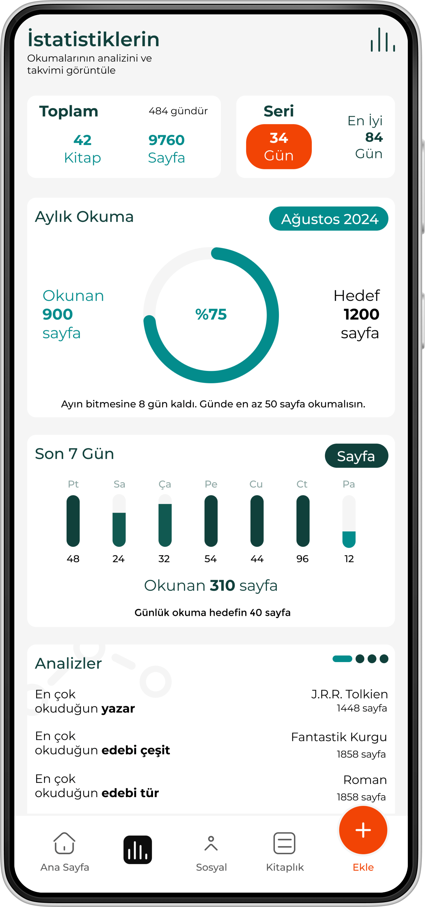
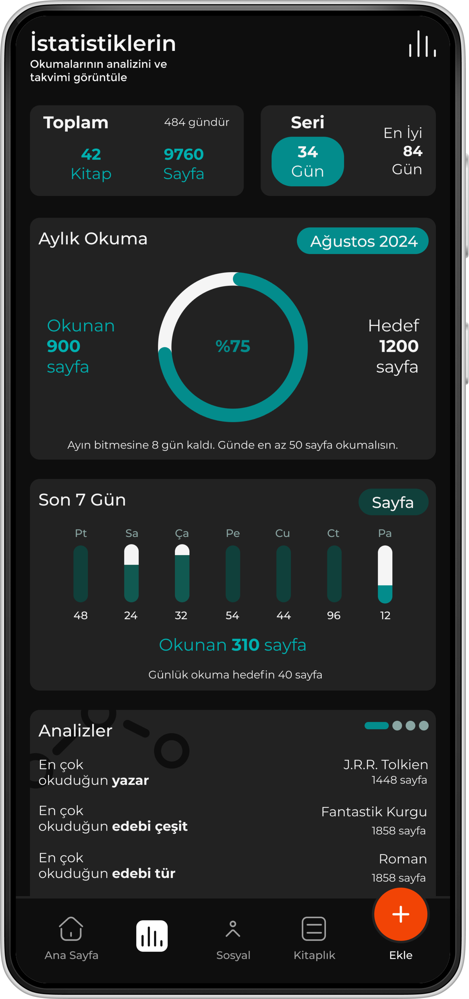
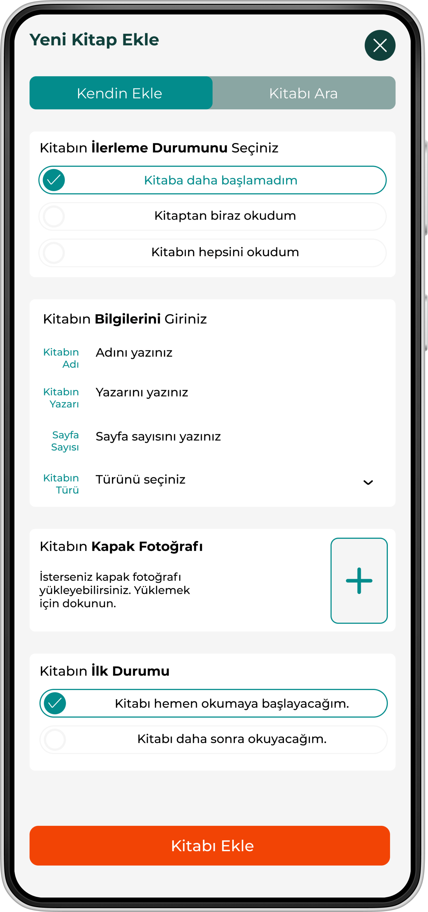
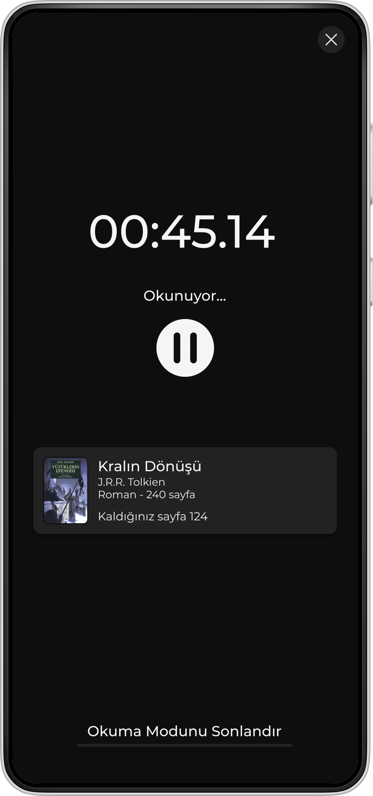
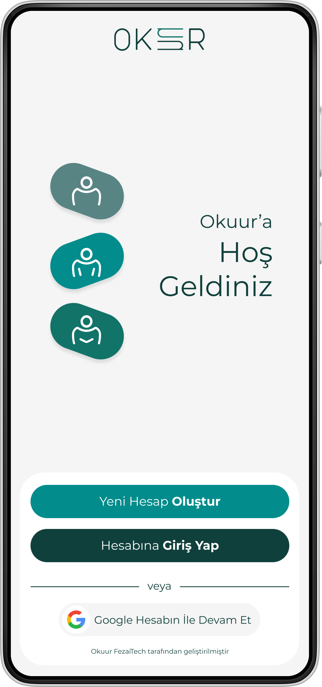
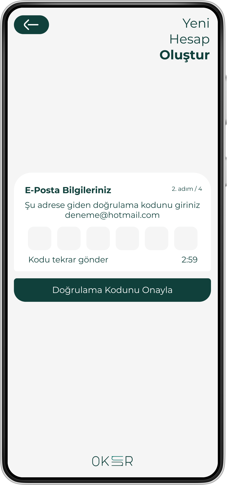
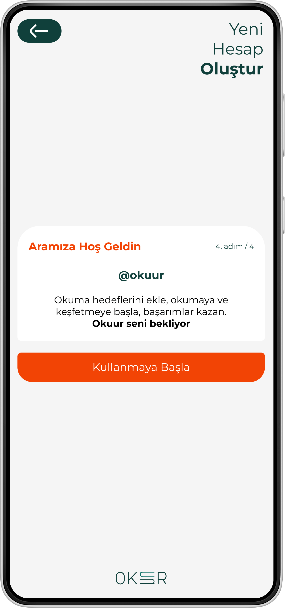

[](https://github.com/zahidayturan/okuur-book-tracker-mobile-app/blob/main/README.md)
[](https://github.com/zahidayturan/okuur-book-tracker-mobile-app/blob/main/README.tr.md)

<h1 align="center">OKUUR</h1>
<p align="center"></p>

**Okuur / Book Tracker App**

The app offers various features to help users manage their reading experience more efficiently. 

With this mobile application, you can digitize your library, track your reading progress, and view your statistics. You can also connect with other readers as friends, see what they are reading, and read together. By logging each of your readings, you can maintain a reading streak. Discover other users' books and add new titles to your library.

The digital library and reading tracking app is developed using [**Flutter**](https://flutter.dev/). It includes both light and dark themes, and work is underway to support multiple languages. The UI/UX design has been created using **Figma**. **Get** is used for state management within the app. **Firebase Auth** and **Google Sign In** packages are integrated for user authentication. **Firestore** ensures real-time synchronization of user data, providing a consistent experience across all devices. **Firebase Storage** is used to store books and other files securely.

### Dependencies

This project is built with a variety of great open source libraries and packages.


* [get](https://pub.dev/packages/get) - State management (lightweight and efficient for managing app state)
* [get_storage](https://pub.dev/packages/get_storage) - State management (persistent local storage for simple key-value pairs)
* [firebase_core](https://pub.dev/packages/firebase_core) - Required to initialize Firebase for connecting to Firebase services
* [firebase_auth](https://pub.dev/packages/firebase_auth) - Firebase Authentication for user login, registration, and authentication
* [cloud_firestore](https://pub.dev/packages/cloud_firestore) - Firestore for real-time database and data management
* [firebase_storage](https://pub.dev/packages/firebase_storage) - Firebase Cloud Storage for file upload/download
* [google_sign_in](https://pub.dev/packages/firebase_messaging) - For implementing Google sign-in using Firebase Authentication
* [flutter_localization](https://pub.dev/packages/flutter_localization) - In-app localization (important for multi-language support)
* [intl](https://pub.dev/packages/intl) - Internationalization support (useful for date formatting, number formatting, etc.)
* [image_picker](https://pub.dev/packages/image_picker) - Allows users to pick images from the gallery or capture them using the camera
* [path_provider](https://pub.dev/packages/googleapis_auth) - Provides access to directories on the device’s file system (e.g., for saving files)
* [cupertino_icons](https://pub.dev/packages/cupertino_icons) - Provides iOS-style icons for use in Flutter apps
* [shimmer](https://pub.dev/packages/shimmer) - A package for adding shimmer effect to your widgets (good for loading indicators)
* [flutter_native_splash](https://pub.dev/packages/flutter_native_splash) - Custom splash screen (useful for app branding and smooth start-up)


### The application currently supports Turkish language. Work is ongoing for English language support.

<table>
  <tr>
    <td colspan="2"><h3 align="center">Home Page</h3></td>
  </tr>
  <tr>
    <td align="center"></td>
    <td align="center"></td>
  </tr>
</table>

<table>
  <tr>
    <td colspan="2"><h3 align="center">Statistics Page</h3></td>
  </tr>
  <tr>
    <td align="center"></td>
    <td align="center"></td>
  </tr>
</table>


<table>
  <tr>
    <td><h3 align="center">Library Page</h3></td>
    <td><h3 align="center">Profile Page</h3></td>
  </tr>
  <tr>
    <td align="center"></td>
    <td align="center"></td>
  </tr>
</table>


<table>
  <tr>
    <td><h3 align="center">Add Book Page</h3></td>
    <td><h3 align="center">Add Reading Page</h3></td>
  </tr>
  <tr>
    <td align="center"></td>
    <td align="center"></td>
  </tr>
</table>

<table>
  <tr>
    <td><h3 align="center">Book Detail Page</h3></td>
    <td><h3 align="center">Readings Page</h3></td>
  </tr>
  <tr>
    <td align="center"></td>
    <td align="center"></td>
  </tr>
</table>

<table>
  <tr>
    <td colspan="2"><h3 align="center">Serie Page</h3></td>
  </tr>
  <tr>
    <td align="center"></td>
    <td align="center"></td>
  </tr>
</table>


<table>
  <tr>
    <td><h3 align="center">Settings Page</h3></td>
    <td><h3 align="center">Reading Mode Page</h3></td>
  </tr>
  <tr>
    <td align="center"></td>
    <td align="center"></td>
  </tr>
</table>

<table>
  <tr>
    <td colspan="2"><h3 align="center">Welcome Page</h3></td>
  </tr>
  <tr>
    <td align="center"></td>
    <td align="center"></td>
  </tr>
</table>


<table>
  <tr>
    <td colspan="2"><h3 align="center">Create Account Pages</h3></td>
  </tr>
  <tr>
    <td align="center"></td>
    <td align="center"></td>
  </tr>
</table>

<table>
  <tr>
    <td colspan="2"><h3 align="center">App Setup Pages</h3></td>
  </tr>
  <tr>
    <td align="center"></td>
    <td align="center"></td>
  </tr>
</table>

### Installation
```sh
$ pub get
```
**TODO**

## How can I support developers?
- Star our GitHub repo
- Create pull requests, submit bugs, suggest new features or documentation updates
- Follow our work

## Getting Started

This project is a starting point for a Flutter application.

A few resources to get you started if this is your first Flutter project:

- [Lab: Write your first Flutter app](https://flutter.io/docs/get-started/codelab)
- [Cookbook: Useful Flutter samples](https://flutter.io/docs/cookbook)

For help getting started with Flutter, view our
[online documentation](https://flutter.io/docs), which offers tutorials,
samples, guidance on mobile development, and a full API reference.