[](https://github.com/zahidayturan/okuur-book-tracker-mobile-app/blob/main/README.md)
[](https://github.com/zahidayturan/okuur-book-tracker-mobile-app/blob/main/README.tr.md)


<h1 align="center">OKUUR</h1>
<p align="center">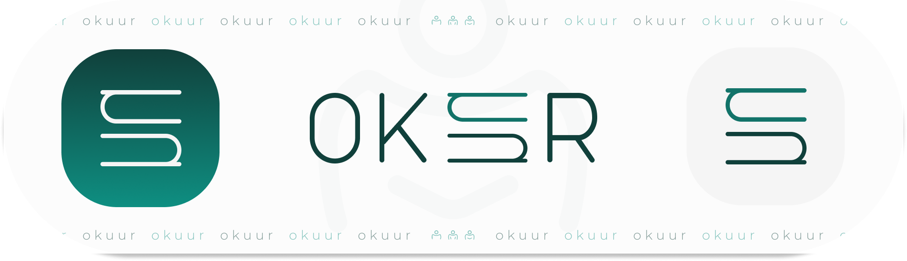</p>

Okuur / Dijital Kitaplık ve Kitap Takip Uygulaması

**Bu mobil uygulama [Flutter](https://flutter.dev/) ile geliştirilmiştir**.

### Bağımlılıklar (Dependencies)

Bu proje, bir dizi harika açık kaynaklı kütüphane ve paket ile oluşturulmuştur.


* [get](https://pub.dev/packages/get) - Durum yönetimi (uygulama durumu yönetimi için hafif ve verimli)
* [get_storage](https://pub.dev/packages/get_storage) - Durum yönetimi (basit anahtar-değer çiftleri için kalıcı yerel depolama)
* [firebase_core](https://pub.dev/packages/firebase_core) - Firebase ile bağlantı kurmak için Firebase’i başlatmak için gereklidir
* [firebase_auth](https://pub.dev/packages/firebase_auth) - Kullanıcı girişi, kayıt ve kimlik doğrulama işlemleri için Firebase Kimlik Doğrulama
* [cloud_firestore](https://pub.dev/packages/cloud_firestore) - Gerçek zamanlı veritabanı ve veri yönetimi için Firestore
* [firebase_storage](https://pub.dev/packages/firebase_storage) - Dosya yükleme/indirme için Firebase Cloud Storage
* [google_sign_in](https://pub.dev/packages/firebase_messaging) - Firebase Kimlik Doğrulama ile Google ile giriş yapma
* [flutter_localization](https://pub.dev/packages/flutter_localization) - Uygulama içi yerelleştirme (çoklu dil desteği için önemli)
* [intl](https://pub.dev/packages/intl) - Uluslararasılaşma desteği (tarih formatlama, sayı formatlama vb. için faydalı)
* [image_picker](https://pub.dev/packages/image_picker) - Kullanıcıların galeriye resim seçmesine veya kamera ile çekim yapmasına olanak tanır
* [path_provider](https://pub.dev/packages/googleapis_auth) - Cihazın dosya sistemindeki dizinlere erişim sağlar (örneğin, dosya kaydetmek için)
* [cupertino_icons](https://pub.dev/packages/cupertino_icons) - Flutter uygulamalarında kullanmak için iOS tarzı simgeler sağlar
* [shimmer](https://pub.dev/packages/shimmer) - Widget'larınıza shimmer efekti eklemek için bir paket (yükleniyor göstergeleri için iyi)
* [flutter_native_splash](https://pub.dev/packages/flutter_native_splash) - Özel açılış ekranı (uygulama markası ve sorunsuz başlatma için faydalıdır)


<table align="center">
  <tr>
    <td colspan="2" style="text-align: center;"><h3>Ana Sayfa</h3></td>
  </tr>
  <tr>
    <td>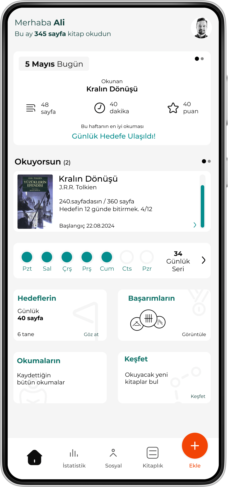</td>
    <td>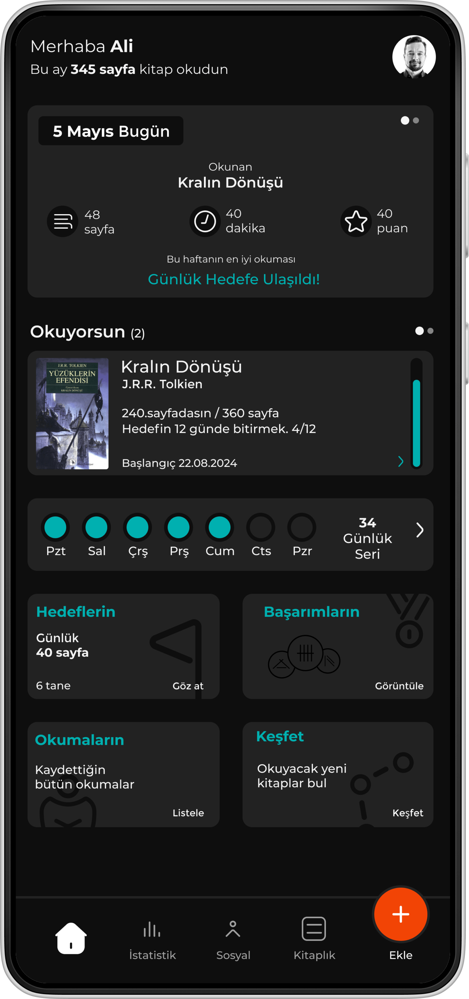</td>
  </tr>
</table>

<table align="center">
  <tr>
    <td colspan="2" style="text-align: center;"><h3>İstatistik Sayfası</h3></td>
  </tr>
  <tr>
    <td>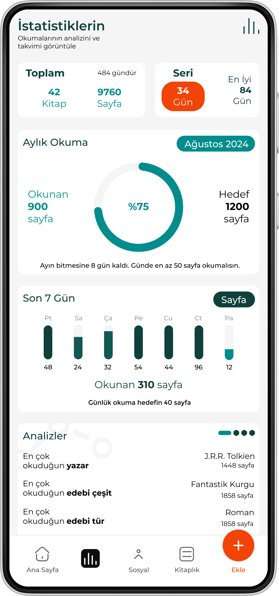</td>
    <td>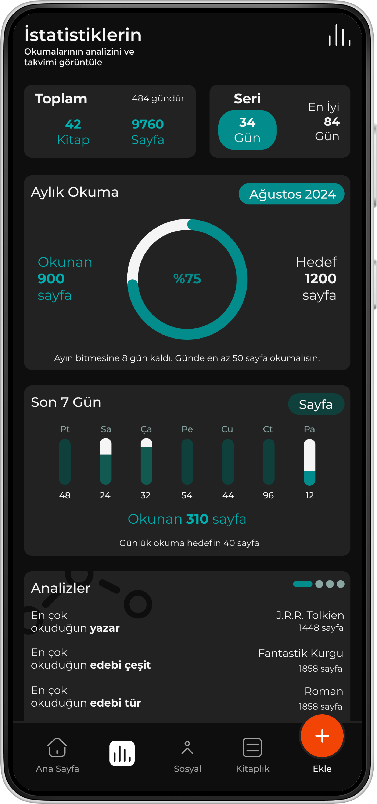</td>
  </tr>
</table>


<table align="center">
  <tr>
    <td style="text-align: center;"><h3>Kitaplık Sayfası</h3></td>
    <td style="text-align: center;"><h3>Profil Sayfası</h3></td>
  </tr>
  <tr>
    <td>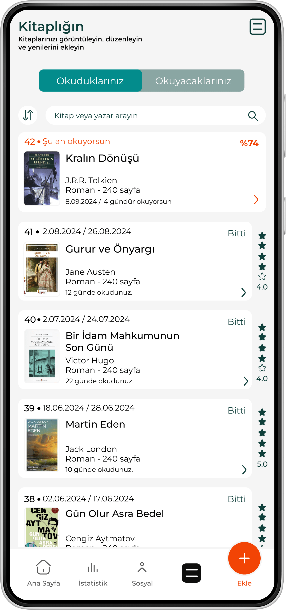</td>
    <td>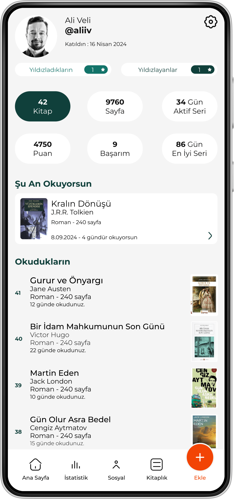</td>
  </tr>
</table>


<table align="center">
  <tr>
    <td style="text-align: center;"><h3>Kitap Ekleme Sayfası</h3></td>
    <td style="text-align: center;"><h3>Okuma Ekleme Sayfası</h3></td>
  </tr>
  <tr>
    <td>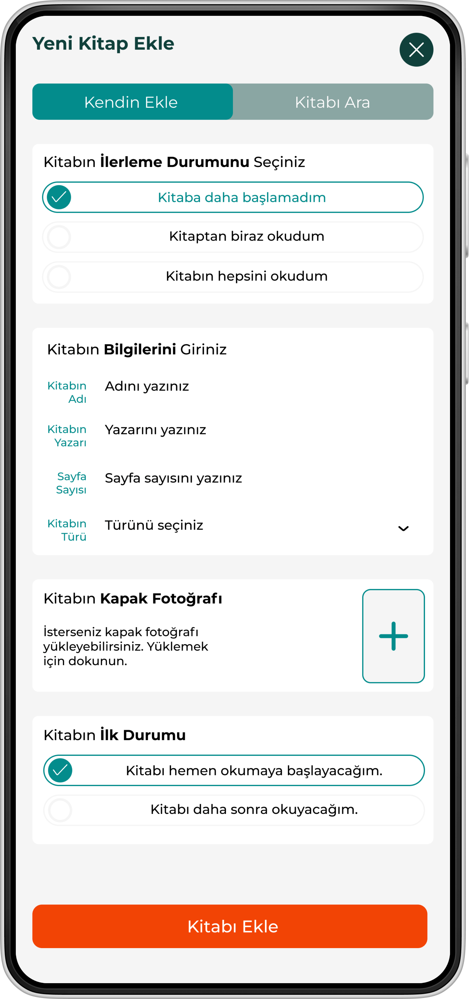</td>
    <td>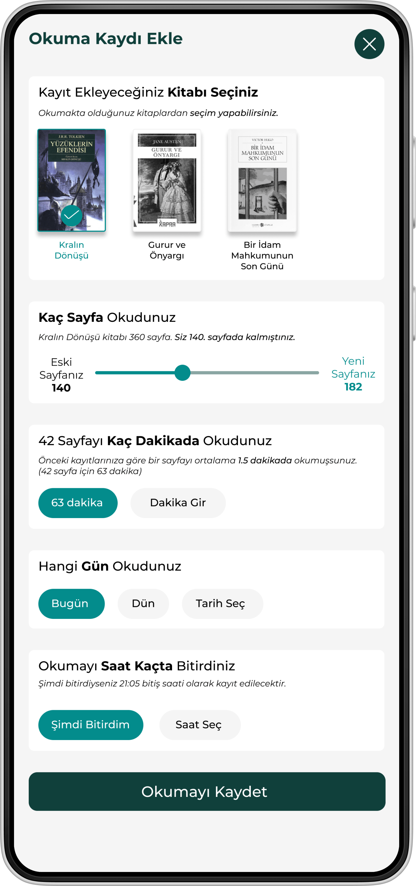</td>
  </tr>
</table>

<table align="center">
  <tr>
    <td style="text-align: center;"><h3>Kitap Detay Sayfası</h3></td>
    <td style="text-align: center;"><h3>Okumalar Sayfası</h3></td>
  </tr>
  <tr>
    <td>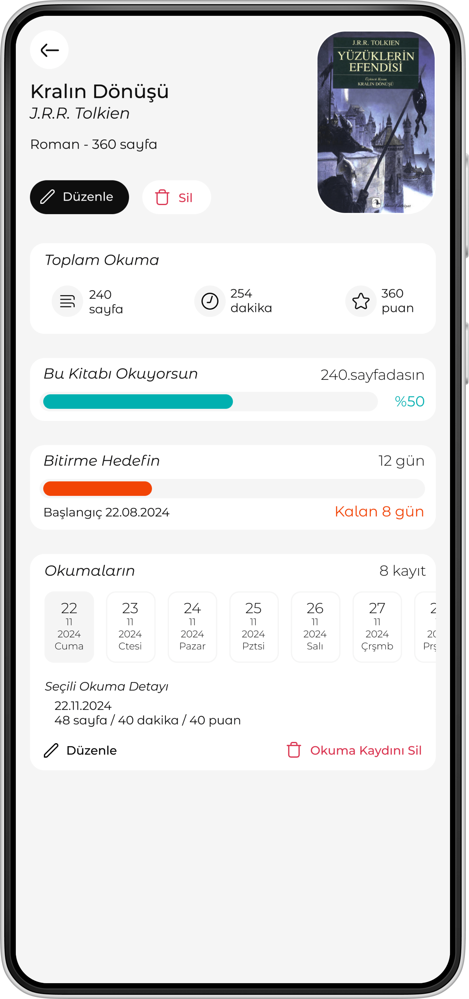</td>
    <td>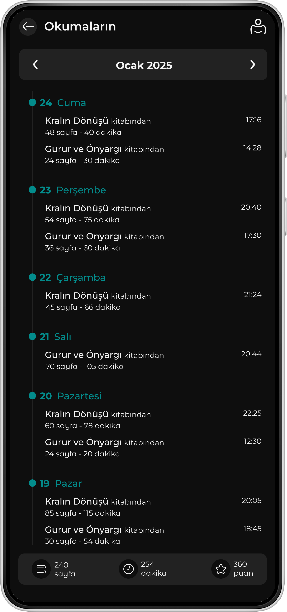</td>
  </tr>
</table>

<table align="center">
  <tr>
    <td colspan="2" style="text-align: center;"><h3>Okuma Seri Sayfası</h3></td>
  </tr>
  <tr>
    <td>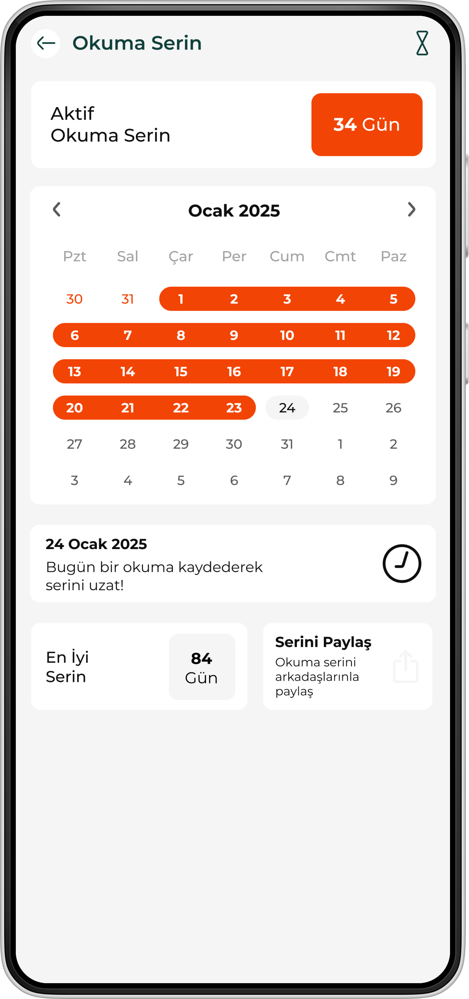</td>
    <td>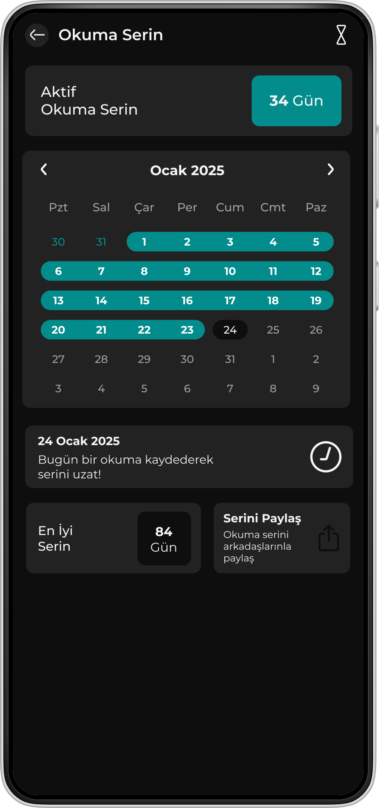</td>
  </tr>
</table>


<table align="center">
  <tr>
    <td style="text-align: center;"><h3>Ayarlar Sayfası</h3></td>
    <td style="text-align: center;"><h3>Okuma Modu Sayfası</h3></td>
  </tr>
  <tr>
    <td>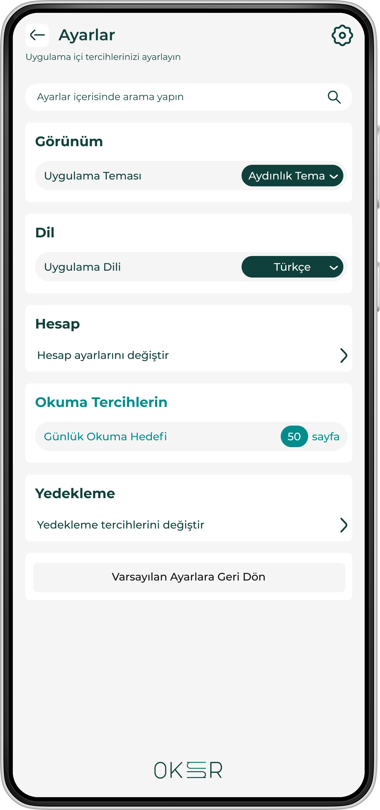</td>
    <td>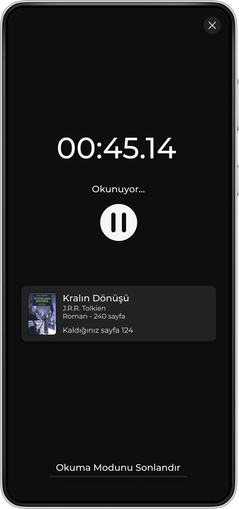</td>
  </tr>
</table>

<table align="center">
  <tr>
    <td colspan="2" style="text-align: center;"><h3>Karşılama Sayfası</h3></td>
  </tr>
  <tr>
    <td>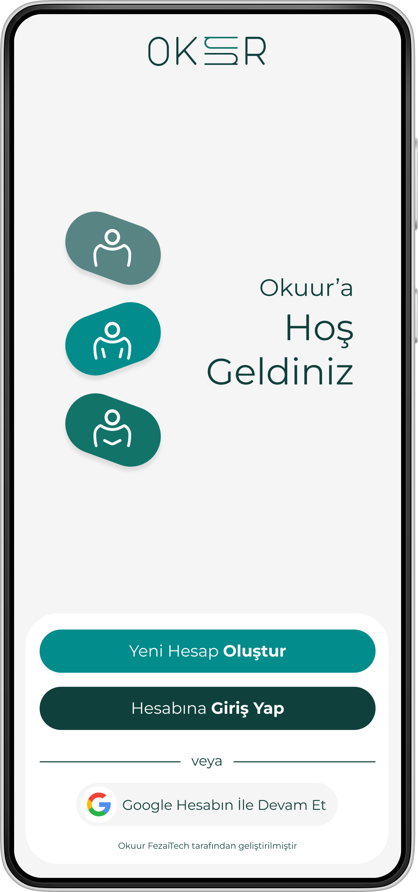</td>
    <td>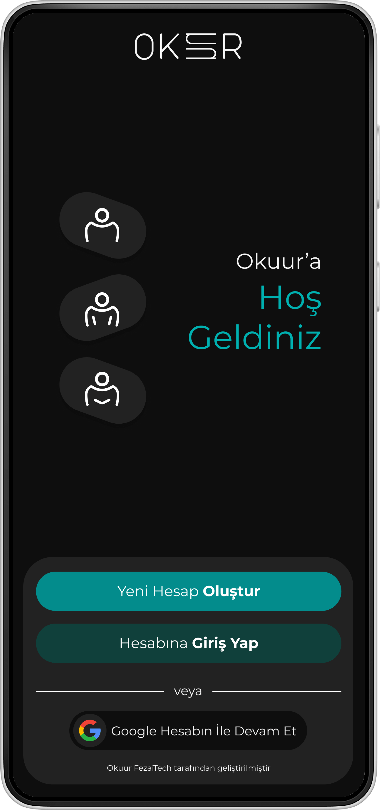</td>
  </tr>
</table>


<table align="center">
  <tr>
    <td colspan="2" style="text-align: center;"><h3>Hesap Oluşturma Sayfaları</h3></td>
  </tr>
  <tr>
    <td>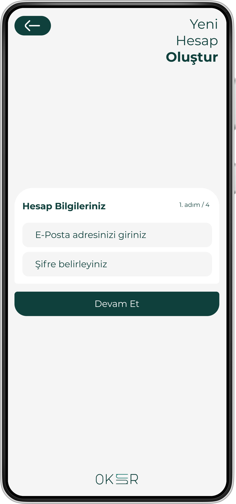</td>
    <td>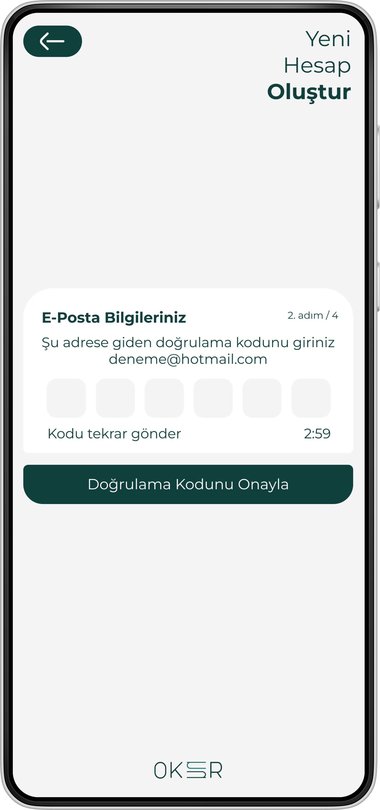</td>
  </tr>
</table>

<table align="center">
  <tr>
    <td colspan="2" style="text-align: center;"><h3>Kurulum Sayfaları</h3></td>
  </tr>
  <tr>
    <td>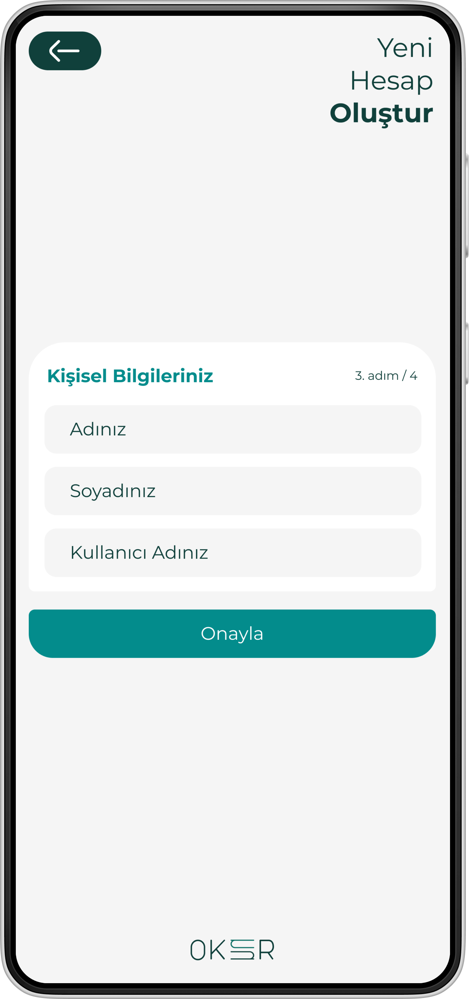</td>
    <td>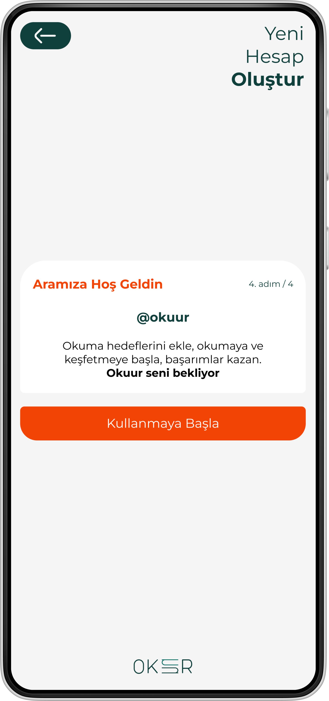</td>
  </tr>
</table>


### Kurulum
```sh
$ pub get
```
**TODO**

## Geliştiricilere Nasıl Destek Olabilirim?
- GitHub repo'muza yıldız verin
- Pull request'ler oluşturun, hata bildirin, yeni özellikler veya dokümantasyon güncellemeleri önerin
- Çalışmalarımızı takip edin

## Başlarken

Bu proje, bir Flutter uygulaması için bir başlangıç noktasıdır.

Eğer bu sizin ilk Flutter projenizse, başlamak için bazı kaynaklar:

- [Laboratuvar: İlk Flutter uygulamanızı yazın](https://flutter.io/docs/get-started/codelab)
- [Cookbook: Kullanışlı Flutter örnekleri](https://flutter.io/docs/cookbook)

Flutter ile başlamak için yardıma ihtiyacınız varsa,
[çevrimiçi dokümantasyona](https://flutter.io/docs), göz atabilirsiniz. Bu dokümantasyon, eğitimler, örnekler, mobil geliştirme ile ilgili rehberlik ve tam API referansı sunmaktadır.

